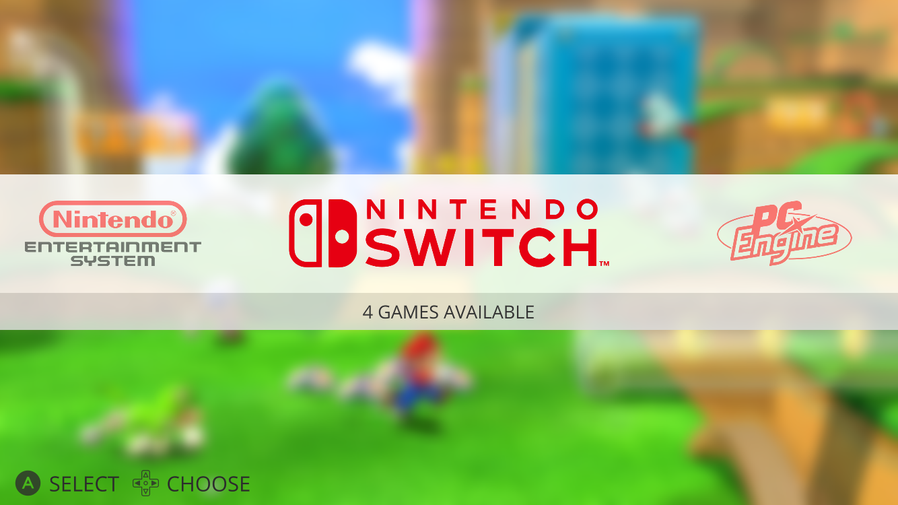
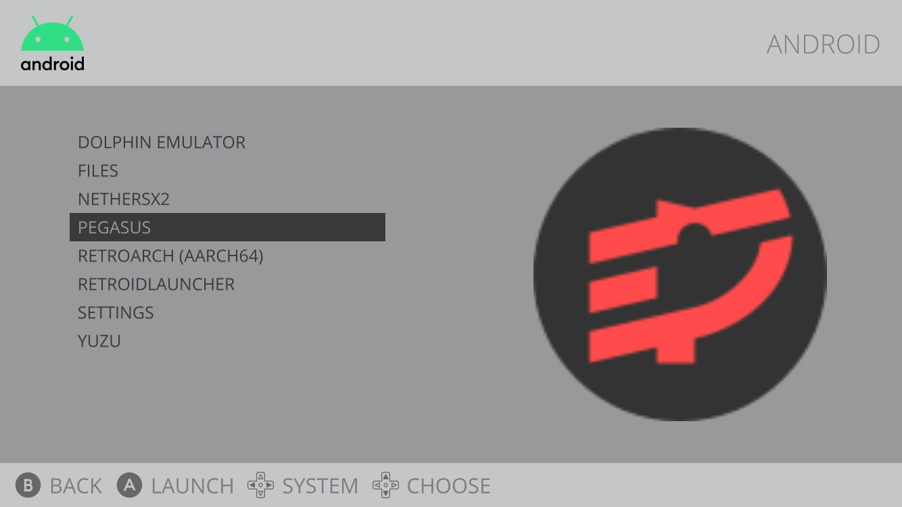
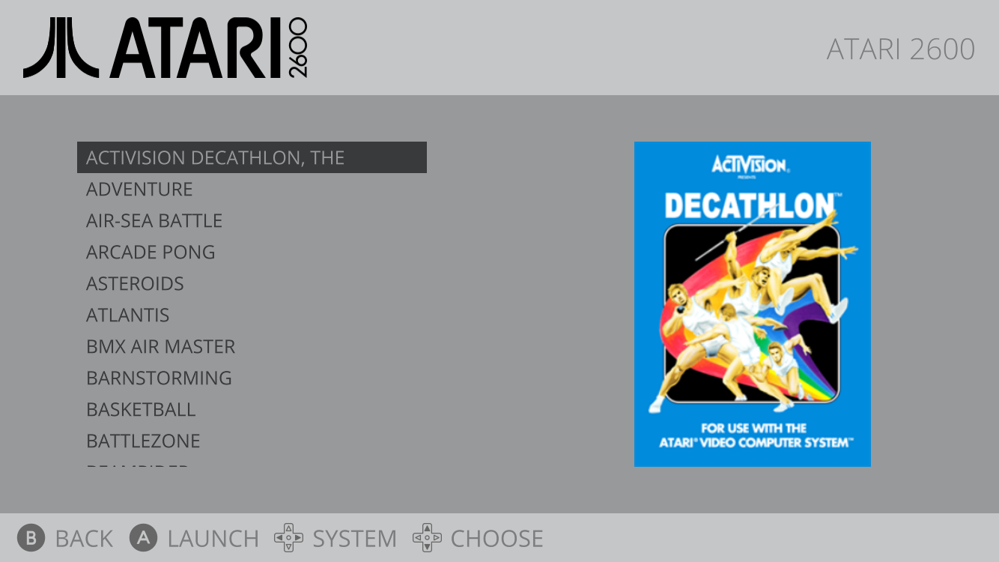

# Emulation Station Simple Clean Theme

Pegasus Frontend Theme optimized for Handheld. You need to have Pegasus installed in your handheld

**It's also compatible with 16:9 and 4:3 handhelds**

## Assets needed

For this theme you need the following media types from [skraper](http://skraper.net):

- screenshot
- wheel

## Theme Installation

1 Download in (https://github.com/ElectronicRave/ES-Simple-Clean/releases) or (https://pegasus-frontend.org/tools/themes/)

2 Unzip the downloaded file.

1 Upload the folder to /pegasus-frontend/themes/ES-Simple-Clean-main

4 Open Pegasus, go to Settings - General - Theme and select ES Simple Clean

## Home Screen

## Content Screen

- A  - Launch the Game
- B  - Goes back to the Home Page
- TOUCH - Access to all features

In this list you can see all content in the System, in this screen you can do several things by pressing different buttons:

- A  - Launch the Game
- B  - Goes back to the Home Page
- L1 - Previnious page
- R1 - Next page
- L2 - Previous system
- R2 - Next system
- TOUCH - Access to all features